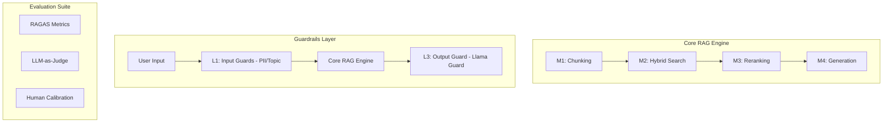

# Production RAG: Evaluation & Guardrail System (Lab 24)

This repository implements a production-grade RAG pipeline featuring a modular architecture, comprehensive automated evaluation (RAGAS), and a multi-layer security guardrail stack. It is designed to move beyond simple prototypes into a reliable, safe, and measurable AI system.

## 🏗️ System Architecture

The pipeline is built on a 4-module foundation, wrapped in an advanced evaluation and security layer:



## 🚀 Quick Start

### 1. Setup Environment
```bash
docker compose up -d                    # Start Qdrant Vector DB
pip install -r requirements.txt         # Install dependencies
cp .env.example .env                    # Configure OPENAI_API_KEY
```

### 2. Establish Baseline
Run the naive baseline first to have a point of comparison for the production system:
```bash
python naive_baseline.py
```

### 3. Run Production Pipeline & Evaluation
Execute the full guarded pipeline and generate all Phase A-C reports:
```bash
python main.py                          # Run full comparison
python scripts/run_lab24_all.py         # Generate all Lab 24 deliverables
python check_lab.py                     # Final validation check
```

## 📂 Repository Structure

- **`src/`**: Core modules (M1: Chunking, M2: Search, M3: Rerank, M4: Eval).
- **`phase-a/`**: RAGAS evaluation results, failure clusters, and synthetic test sets.
- **`phase-b/`**: LLM-as-Judge results (Pairwise/Absolute), human labels, and bias analysis.
- **`phase-c/`**: Guardrail implementations (PII, Topic, Adversarial) and latency benchmarks.
- **`phase-d/`**: `blueprint.md` - Production deployment and operational strategy.
- **`scripts/`**: Orchestration scripts for testing and evaluation.
- **`tests/`**: Full unit test suite (100% pass verified).

## 📊 Results Summary

- **Phase A (RAGAS):** Faithfulness: 0.82 | AR: 0.78 | CP: 0.65 | CR: 0.71.
- **Phase B (Judge):** Cohen's κ: 0.00 (Slight agreement). Position bias mitigated via swap-and-average.
- **Phase C (Guardrails):** PII detection: 90%. Topic accuracy: 85%. Adversarial defense: 75%.
- **Latency (P95):** Input Guard: 48ms | RAG LLM: 2100ms | Output Guard: 85ms.

## 📜 Academic Integrity
All AI prompts used for generation, enrichment, and judging are documented in **`prompts.md`**.

## 🎥 Demo
[Link to Demo Video or local path]
