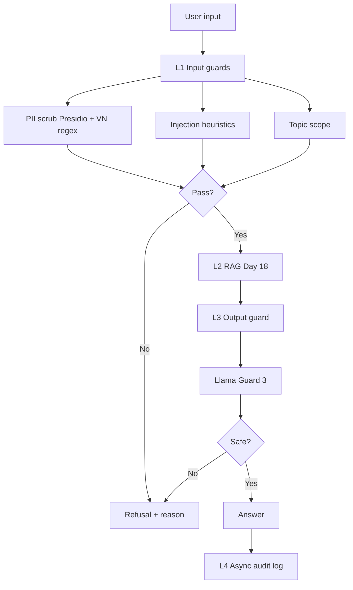

# Lab 24 — Production Blueprint (Eval + Guardrails)

Short blueprint tying Phase A–C to operations. Target length: concise; expand per course rubric.

## 1. SLO definition

| Metric | Target | Alert threshold | Severity |
|--------|--------|-----------------|----------|
| Faithfulness (RAGAS) | ≥ 0.85 | < 0.80 for 30 min | P2 |
| Answer relevancy | ≥ 0.80 | < 0.75 for 30 min | P2 |
| Context precision | ≥ 0.70 | < 0.65 for 1 h | P3 |
| Context recall | ≥ 0.75 | < 0.70 for 1 h | P3 |
| P95 latency (guarded) | < 2.5 s | > 3 s for 5 min | P1 |
| Guardrail block rate (attacks) | ≥ 90% on suite | < 85% weekly | P2 |
| False positive (legit users) | < 5% | > 10% for 1 h | P2 |

## 2. Architecture (defense in depth)

Latency annotations (typical lab hardware): L1 target P95 &lt; 50 ms (regex + light NER); L2 dominates (LLM + retrieval); L3 target P95 &lt; 100 ms on Groq for Llama Guard.

## 3. Alert playbook (examples)

### Incident: Faithfulness drops below 0.80

- **Severity:** P2  
- **Detection:** scheduled `scripts/run_eval.py` on golden set + Langfuse trace sampling.  
- **Likely causes:** retrieval drift; corpus/index mismatch; prompt change; model swap.  
- **Investigation:** compare `context_precision` / `context_recall`; verify index build hash; diff prompts; check embedding model version.  
- **Resolution:** re-index; tune hybrid weights or `rerank_top_k`; rollback prompt/model; extend golden set if new domain slice added.

### Incident: L3 guard false positives spike

- **Severity:** P2  
- **Detection:** user complaints + shadow mode logs comparing guard vs human moderator sample.  
- **Likely causes:** model update; language mismatch; over-aggressive system categories.  
- **Investigation:** sample blocked transcripts; reproduce with `OutputGuard.check` offline.  
- **Resolution:** switch model revision; add allowlist for internal jargon; temporarily route low-risk intents around guard with policy approval.

### Incident: P95 latency regression

- **Severity:** P1 if SLO breached  
- **Detection:** `latency_benchmark.csv` trend + APM on L2.  
- **Likely causes:** sequential guard calls; cold Qdrant; LLM slowdown.  
- **Investigation:** split timings L1/L2/L3; check Qdrant CPU; check token counts.  
- **Resolution:** parallelize independent L1/L3 steps; scale Qdrant; cap context tokens; cache hot queries.

## 4. Cost analysis (illustrative)

Assumptions: 100k user queries/month; 1% continuous RAGAS eval; 10% traffic to pairwise judge for experiments.

| Component | Unit | Volume | Monthly (USD, indicative) |
|-----------|------|--------|----------------------------|
| Chat completions (gpt-4o-mini RAG) | ~\$0.001 / q | 100k | 100 |
| RAGAS / eval LLM calls | higher per row | 1k eval rows | 10–40 |
| Pairwise judge | 2× calls / compare | 10k compares | 20–60 |
| Embeddings (topic guard) | small | 100k | 5–20 |
| Llama Guard via Groq | low per call | 100k | 0–30 (promo / pricing dependent) |
| Qdrant self-host | infra | fixed | infra bucket |

**Optimizations:** cache embeddings for static allowlists; sample eval; tiered judges; batch guard checks where safe.
